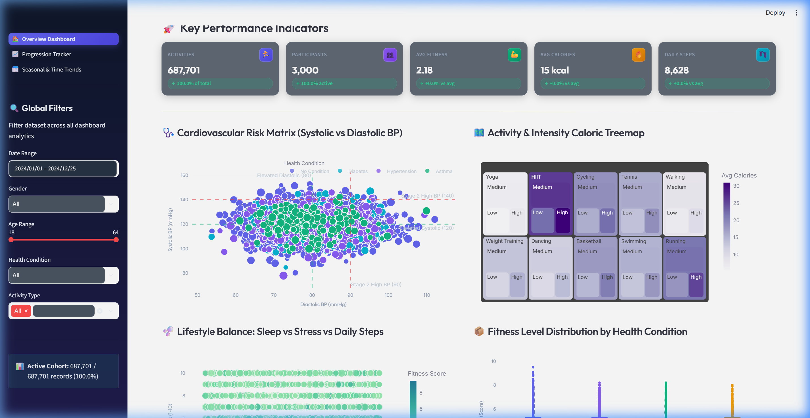
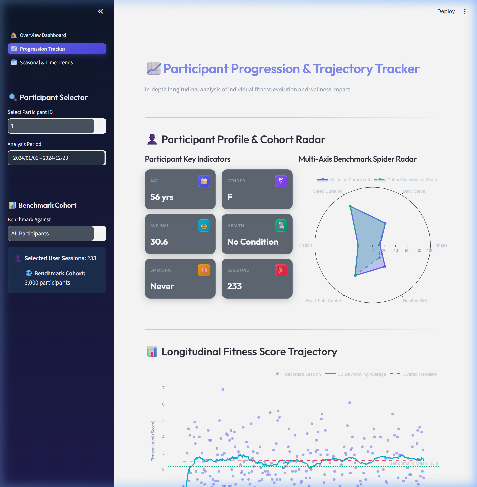
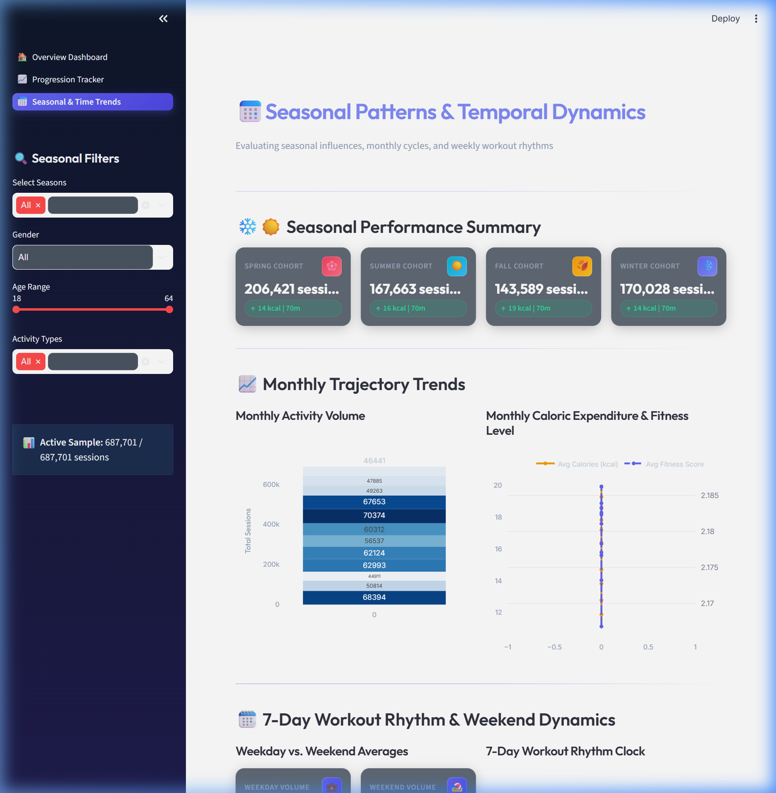
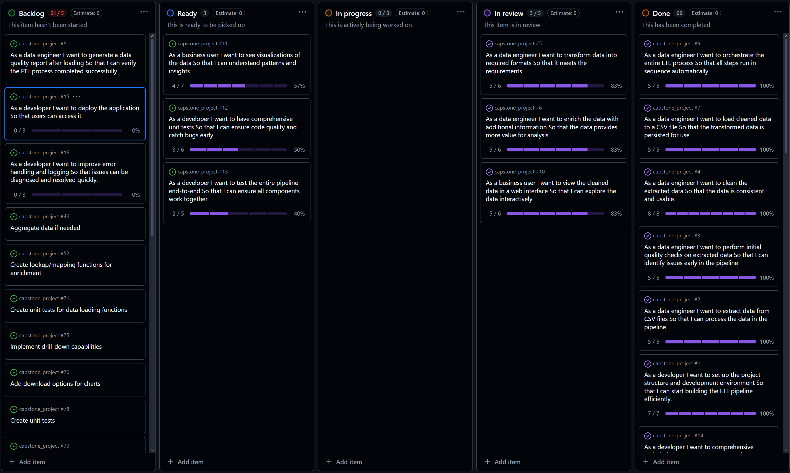

# 🏋️ FitLife Data Pipeline & Analytics Dashboard (ETL Capstone)

[](https://data-engineering-capstone-project.streamlit.app/)
[](https://www.python.org/)
[](https://streamlit.io/)
[](https://pandas.pydata.org/)
[](https://docs.pytest.org/)
[](https://flake8.pycqa.org/)
[](https://parquet.apache.org/)

> 🚀 **Live Interactive Dashboard:** [https://data-engineering-capstone-project.streamlit.app/](https://data-engineering-capstone-project.streamlit.app/)

A robust, enterprise-grade Python **ETL (Extract, Transform, Load)** pipeline and interactive **Streamlit Analytics Dashboard** built to process, clean, enrich, and visualize longitudinal fitness and health tracking metrics.

---

## 🌟 Executive Summary

The **FitLife ETL Capstone Project** delivers an end-to-end data engineering solution that converts raw, noisy fitness tracking data into high-value analytical datasets. The pipeline standardizes demographic data, imputes missing metrics, recalculates BMIs, computes rolling trends, and loads optimized **Parquet** and **CSV** datasets powering a multi-page interactive Streamlit dashboard.

👉 **Experience the live dashboard:** **[data-engineering-capstone-project.streamlit.app](https://data-engineering-capstone-project.streamlit.app/)**

---

## 📸 Dashboard Preview

### 1. Overview Dashboard
High-level KPIs, activity distributions, daily steps breakdown, and health condition distributions across all participants.



### 2. Participant Progression & Trajectory Tracker
In-depth longitudinal tracking of individual participant progression with 30-day moving averages, linear trendlines, and cohort radar benchmarking.



### 3. Seasonal & Time Pattern Analysis
Seasonal activity trends, monthly calorie expenditure patterns, and correlations between sleep, stress, and activity intensity.



### 4. Agile Project Management
Agile task backlog tracking development execution from raw ingestion to dashboard deployment.



---

## 🏗️ Architecture & Pipeline Workflow

```
┌─────────────────┐      ┌───────────────────────────┐      ┌─────────────────────────────┐      ┌────────────────────────┐      ┌──────────────────────────────┐
│  Raw Data Source│      │       Extract Phase       │      │       Transform Phase       │      │       Load Phase       │      │     Visualisation Layer      │
│                 │ ───► │                           │ ───► │                             │ ───► │                        │ ───► │                              │
│ Kaggle CSV File │      │ - File Integrity Checks   │      │ - Format Standardisation    │      │ - Compressed Parquet   │      │ - Streamlit Multi-Page App   │
│ (100k+ Records) │      │ - Structured Logging      │      │ - Imputation & Deduplication│      │ - Cleaned CSV Output   │      │ - Interactive Plotly Charts  │
└─────────────────┘      └───────────────────────────┘      │ - BMI & Metric Enrichment   │      └────────────────────────┘      └──────────────────────────────┘
                                                            └─────────────────────────────┘
```

### ETL Pipeline Stages

1. **Extract**:
   - Ingests raw CSV records (`uncleaned_fitness_stats.csv`).
   - Validates file paths, column schemas, and raw data types.
   - Outputs extraction telemetry and row counts via structured logging.

2. **Transform**:
   - **Data Cleaning**: Standardizes date formats, fills missing values, and removes duplicate entries.
   - **Validation**: Filters out invalid outliers (e.g., unrealistic age ranges).
   - **Data Enrichment**: Recalculates exact BMI scores, assigns health condition brackets, and computes weekly activity summaries and 30-day rolling averages per participant.

3. **Load**:
   - Exports clean data to columnar **Parquet** format (`.parquet`) for fast analytical queries.
   - Exports secondary formatted **CSV** output files for backwards compatibility and external reporting.

4. **Visualise**:
   - Powers a responsive, 3-page interactive dashboard built with **Streamlit** and **Plotly**.

---

## 📁 Repository Structure

```
capstone_project/
├── config/                  # Environment and database configuration management
│   ├── db_config.py         # Database utilities & parameters
│   └── env_config.py        # Environment switcher (.env.dev, .env.test)
├── data/                    # Storage directories for data lifecycles
│   ├── raw/                 # Input uncleaned data files
│   ├── processed/           # Transformed datasets (CSV & Parquet)
│   └── output/              # Final loaded outputs for analytics
├── docs/                    # Documentation & visual assets
│   ├── image/               # Dashboard screenshots & presentation diagrams
│   └── presentation.md      # Comprehensive executive project report
├── scripts/                 # CLI entry points and runner scripts
│   ├── run_app.py           # Unified runner script (ETL + Streamlit)
│   └── generate_sample_data.py # Mock dataset generation utility
├── src/                     # Core application source code
│   ├── etl/                 # Pipeline logic
│   │   ├── extract/         # Extraction modules
│   │   ├── transform/       # Cleaning, filtering & enrichment modules
│   │   ├── load/            # Multi-format data exporters
│   │   └── run_etl.py       # Main ETL execution script
│   ├── streamlit/           # Web app codebase
│   │   ├── app.py           # Dashboard entry point
│   │   ├── utils_ui.py      # UI themes, KPI components & layout styling
│   │   └── pages/           # Application sub-pages
│   │       ├── dashboard.py           # Overview metrics page
│   │       ├── fitness_progression.py # Longitudinal participant tracker
│   │       └── seasonal_patterns.py   # Seasonal & trend analysis page
│   └── utils/               # Shared logging & file utilities
├── tests/                   # Complete test suite
│   ├── unit_tests/          # Module unit tests
│   ├── integration_tests/   # Component integration tests
│   ├── component_tests/     # Pipeline stage tests
│   └── e2e_tests/           # End-to-end integration tests
├── .env.dev                 # Development configuration template
├── .env.test                # Testing configuration template
├── .flake8                  # Python style & linting configuration
├── pyproject.toml           # Project metadata & build tool configuration
└── requirements.txt         # Project dependencies
```

---

## 🚀 Getting Started

### Prerequisites

- **Python 3.8+**
- **pip** package manager
- **Git**

### 1. Installation & Environment Setup

Clone the repository and set up a virtual environment:

```bash
# Clone the repository
git clone https://github.com/praiseOjay/capstone_project.git
cd capstone_project

# Create a virtual environment
python -m venv venv

# Activate virtual environment
# Windows (PowerShell):
.\venv\Scripts\Activate.ps1
# macOS/Linux:
source venv/bin/activate

# Install dependencies
pip install -r requirements.txt
```

### 2. Configure Environment

Copy the development environment file:

```bash
cp .env.dev .env
```

> [!NOTE]
> Ensure raw data file `uncleaned_fitness_stats.csv` is placed in `data/raw/fitness_stats/`. You can download the dataset from [Kaggle FitLife Health Dataset](https://www.kaggle.com/datasets/jijagallery/fitlife-health-and-fitness-tracking-dataset).

---

## 📊 Running the Application & Dashboard Access

### 🌐 Live Cloud Deployment (No Setup Required)

The full interactive dashboard is live on Streamlit Community Cloud:
👉 **[https://data-engineering-capstone-project.streamlit.app/](https://data-engineering-capstone-project.streamlit.app/)**

---

### 💻 Running Locally

The project provides entry points via `scripts/run_app.py` for flexible execution:

#### 1. Run Complete Pipeline & Launch Dashboard
Runs the full ETL process, cleans the raw dataset, and launches the Streamlit web application automatically:

```bash
python scripts/run_app.py dev
```

#### 2. Run ETL Pipeline Only
Process raw data without starting the web dashboard:

```bash
python scripts/run_app.py etl_only dev
```

#### 3. Run Dashboard Only
Launch the Streamlit dashboard using previously processed data:

```bash
python scripts/run_app.py streamlit_only dev
```

Access the local dashboard in your web browser at: **`http://localhost:8501`**

---

## 🧪 Testing & Quality Assurance

The codebase includes a comprehensive test suite covering unit, integration, and E2E scenarios.

### Running Tests

```bash
# Run all unit tests
python -m pytest tests/unit_tests/

# Run complete test suite with coverage
python -m pytest tests/
```

### Code Style & Linting

Enforce PEP 8 style standards and database linting using `flake8` and `sqlfluff`:

```bash
# Check Python code quality
flake8 src/ tests/

# Check SQL code formatting
sqlfluff lint
```

---

## 🧰 Technology Stack

| Domain | Technologies |
| :--- | :--- |
| **Language** | Python 3.8+ |
| **Data Processing** | Pandas, NumPy, PyArrow |
| **Visualisation** | Streamlit, Plotly, Altair |
| **Storage Formats** | Parquet (Columnar), CSV |
| **Testing** | Pytest, Pytest-Mock, Pytest-Cov |
| **Code Quality** | Flake8, Sqlfluff |
| **Environment** | python-dotenv |

---

## 📄 License & Attribution

- **Dataset**: [FitLife Health and Fitness Tracking Dataset (Kaggle)](https://www.kaggle.com/datasets/jijagallery/fitlife-health-and-fitness-tracking-dataset)

---

## 👨‍💻 Author

**Praise Ojerinola** ([@praiseOjay](https://github.com/praiseOjay))
- GitHub: [github.com/praiseOjay](https://github.com/praiseOjay)
- Email: [ojerinolapraise@gmail.com](mailto:ojerinolapraise@gmail.com)
